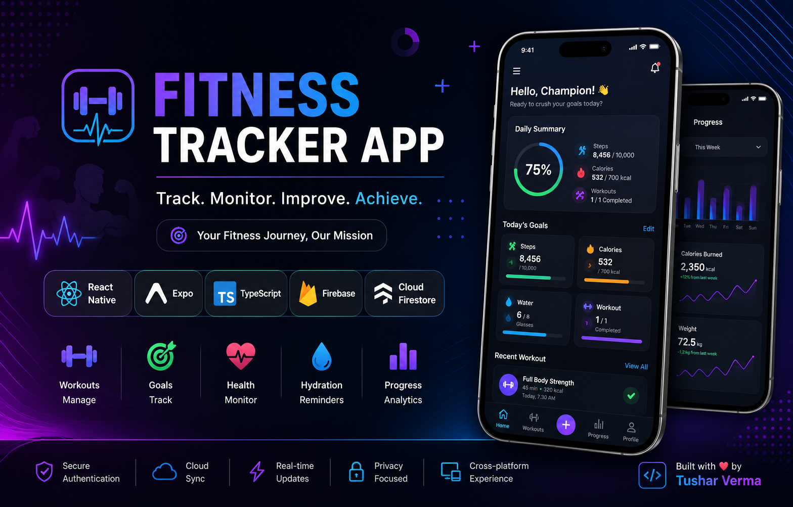
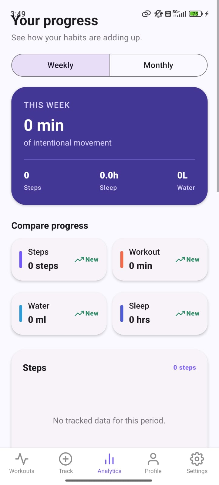
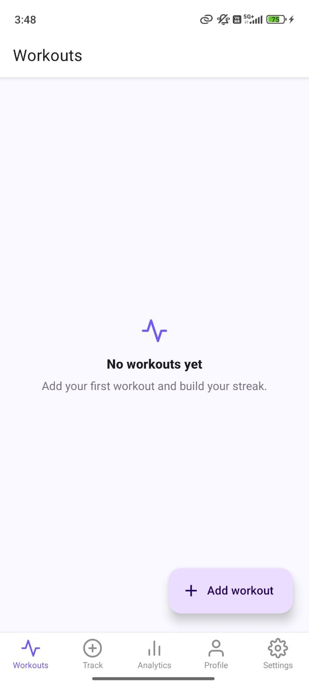
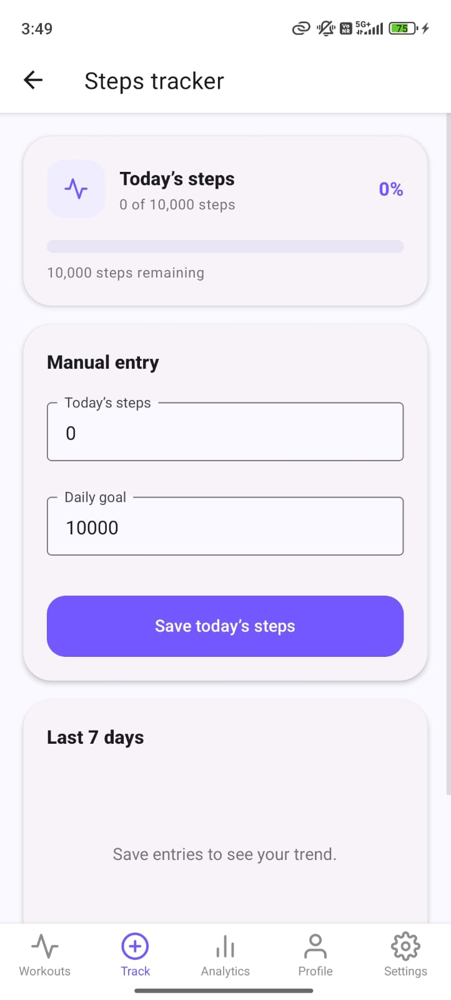
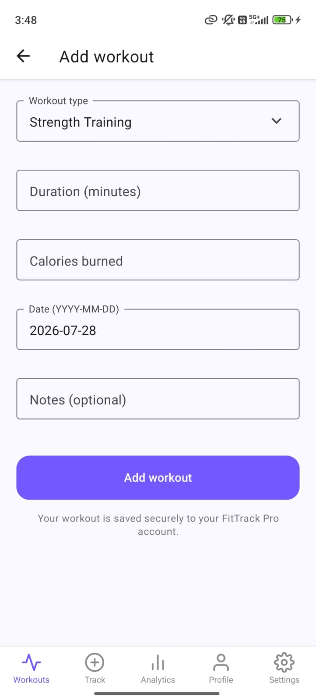
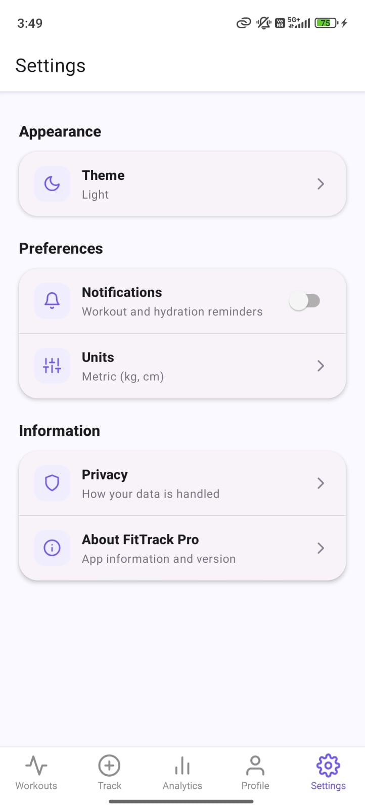

<div align="center">
  

# FitTrack Pro

**A React Native fitness tracker for logging workouts and monitoring daily health habits.**

[](https://expo.dev/)
[](https://reactnative.dev/)
[](https://www.typescriptlang.org/)
[](LICENSE)
</div>

## Overview

FitTrack Pro is an Expo app for recording workouts and keeping daily fitness data in one place. It provides workout logging, trackers for key health habits, progress analytics, profile management, and app settings.

## App preview

<p align="center">
  
  
  
</p>

<p align="center">
  
  
</p>

All screenshots above are real project screens. The add-workout sample uses the date shown in the app: **2026-07-28**.

## Features

| Area | Available functionality |
| --- | --- |
| Workouts | Add, edit, view, and manage workout entries. |
| Daily tracking | Log steps, calories, water, sleep, and weight. |
| Analytics | Review weekly progress and comparison trends. |
| Profile | Maintain profile details and goal summaries. |
| Settings | Manage theme, units, notifications, privacy, and app information. |

## Technology

| Purpose | Tools used |
| --- | --- |
| Mobile app | Expo, React Native, TypeScript |
| Navigation | React Navigation |
| UI | React Native Paper, Expo Vector Icons |
| Forms and validation | React Hook Form, Zod |
| Data | Firebase Authentication and Cloud Firestore |
| Local/device storage | AsyncStorage, Secure Store, Expo Notifications |
| Charts | react-native-chart-kit, react-native-svg |

## Project structure

```text
Fitness-Tracker-App/
|-- App.tsx                 # Navigation and application entry point
|-- src/
|   |-- app/config/         # Firebase configuration
|   |-- features/           # Feature modules: screens, hooks, services, schemas, types
|   |-- theme/              # Shared visual theme
|   `-- utils/              # Shared utilities
|-- .github/images/         # Repository banner and real app screenshots
|-- firestore.rules         # Firestore security rules
`-- package.json            # Scripts and dependencies
```

## Run locally

### 1. Install dependencies

```bash
npm ci
```

### 2. Configure Firebase

Create a local `.env` file from `.env.example` and add your Firebase project values:

```dotenv
EXPO_PUBLIC_FIREBASE_API_KEY=
EXPO_PUBLIC_FIREBASE_AUTH_DOMAIN=
EXPO_PUBLIC_FIREBASE_PROJECT_ID=
EXPO_PUBLIC_FIREBASE_STORAGE_BUCKET=
EXPO_PUBLIC_FIREBASE_MESSAGING_SENDER_ID=
EXPO_PUBLIC_FIREBASE_APP_ID=
```

### 3. Start the app

```bash
npm run start
```

Optional platform commands:

```bash
npm run android
npm run ios
npm run web
```

## Quality checks

```bash
npm run typecheck
npm run lint
```

## License

This project is available under the [MIT License](LICENSE).

## Developer

Built by [Tushar Verma](https://github.com/tusharbuildsdev).
